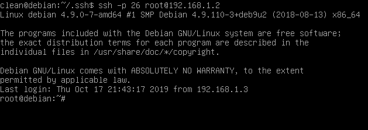
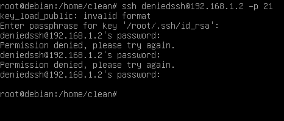

## Tabla de contenidos
0. [Introducción](#intro)

1. [Systemctl](#system)
    + [Servicios](#servicios)
    + [Ejecución](#ejecucion)

2. [SSH](#ssh)
    + [Puerto](#port)
    + [Lista](#list)
    + [Logs](#logs)
    + [Conexión](#test)

3. [Journal](#journal)
    + [Persistente](#journalp)

4. [Netstat](#netstat)
    + [Puertos](#netstatp)

5. [Conclusión](#conclusion)

6. [Fuentes](#fuentes)

<div id='intro'/>

## 0. Introducción 
___

Veremos como configurar los diferentes componentes expuestos en el indice, obviaremos todo lo relaccionado con instalación de paquetes.
Todo los archivos usados están disponibles en este repositorio para su visión y comprobocación de veracidad de la practica.

<div id='system'/>

## 1. SYSTEMCTL
___
Se trata de una herramienta dedicada a la administración de servicios en sistemas linux. Resulta muy util ya que podremos detectar cualquier tipo de incongruencia que nos puede encandenar a problemas de intengridad.

<div id='servicios'/>

#### 1.2 SERVICIOS DE REDES
___
A continuación veremos los servicios en red usados en nuestro sistema. Para ello primero debemos de listar nuestros servicios activos mediante el comando

```
$ systemctl list-unit-files --state=enabled
```
Obtendremos una salida similar a la siguiente

```
UNIT FILE                          STATE  
cups.path                          enabled
autovt@.service                    enabled
avahi-daemon.service               enabled
console-setup.service              enabled
cron.service                       enabled
cups-browsed.service               enabled
cups.service                       enabled
dbus-org.freedesktop.Avahi.service enabled
getty@.service                     enabled
keyboard-setup.service             enabled
networking.service                 enabled
rsyslog.service                    enabled
ssh.service                        enabled
sshd.service                       enabled
syslog.service                     enabled
systemd-timesyncd.service          enabled
vsftpd.service                     enabled
avahi-daemon.socket                enabled
cups.socket                        enabled
remote-fs.target                   enabled
apt-daily-upgrade.timer            enabled
apt-daily.timer                    enabled

22 unit files listed.
```
De todos esos servicios los relaccionados con servicios en red son:
1. networking.service
2. sshd
3. ssh
4. vsftdp 

<div id='ejecucion'/>

#### 1.3 SYSTEMCTL EN EJECUCIÓN 
___
Vamos a proceder a Activar, desactivar, iniciar, parar, recargar un servicio de red con systemctl. El servicio en red que usaremos es networking, se trata de un servicio que controla la tarjeta de red de nuestro equipo.

```
$ systemctl start networking
$ systemctl stop networking
$ systemctl reload networking
$ systemctl restart networking
$ systemctl enable networking
$ systemctl disable networking
```

<div id='ssh'/>

## 2. SSH 
___

Configuraremos sshd para poder realizar las siguientes tareas
1. Para que escuche por un puerto distinto.
2. Crea una lista blanca de usuarios permitidos.
3. Permitir acceso a root solo con clave instalada en el servidor.
4. Activar el registro de logs para el servicio sshd.
5. Probar conexión

Cada configuración realizada en SSH se hará en el fichero de configuración ubicado en
```
$ /etc/ssh/sshd_config
```
Para aplicar los cambios reiniciaremos el servicio mediante
```
$ service sshd restart
```

<div id='port'/>

#### 2.1 Puerto 
___
Para hacer que ssh escuche por un puerto distinto debemos de modificar la directiva Port para darle el siguiente aspecto

```
$ Port 21
```

<div id='list'/>

#### 2.2 Lista de usuarios permitidos
___
Modificaremos la directiva AllowUsers permitiendo acceso al usuario root junto con otro usuario para acceder a ssh

```
$ AllowUsers allowssh root
$ allowssh y root son dos usuarios del sistema.
```
Configuraremos el usuario root para que acceda sin clave mediante la clave publica
```
$ PermitRootLogin without-password
```
Copiaremos la clave publica del cliente hacia el usuario root mediante el siguiente comando

```
ssh-copy-id -i id-rsa.pub root@192.168.1.2 -p 21
```
Una vez copiada debemos de dejar la directiva PasswordAuthentication yes, si cambiamos el valor a "no" no podremos acceder mediante otros usuarios.

<div id='logs'/>

#### 2.3 Logs
___ 

Activaremos una serie de directivas para mostrar información sobre el acceso mediante ssh.
```
$ SysLogFacility AUTH
$ LogLevel INFO
```

<div id='test'/>

### 2.4 Probar conexión
___

Veremos las siguientes comprobaciónes
1. Exitosa
    + Root
        

    + Allowssh
        
2. Erronea   
    + Deniedssh
        

<div id='journal'/>

## 3. Journalctl
___
Journalctl es una herramienta implementada en linux utilizada para la administración de registros del sistema.

El uso que le daremos nosotros será para obtener los logs generados en la verificación de conexión de sshd. Generaremos un log que lea las ultimas diez lineas y lo exportaremos en formato json, para hacerlo usaremos el siguiente comando.
```
$ journalctl -t sshd -o json-pretty -n 10 >> sshd.json
```
+ t = nombre del servicio
+ o = salida del fichero
+ n = lineas que deseamos obtener

Se mostrará la salida de una linea a modo de ejemplo, en el directorio "Logs/ssh.json" se haya el log con las ultimas 10 lineas completas.
```
$ { "__CURSOR" : "s=3ed9f08e374c4aefa21e9e19fc6069a5;i=f25;
b=9f6a4dc3b34448518c703703f728e234;
m=58bca20;t=594da8c557f01;x=cdd577f96d91e79c", 
"__REALTIME_TIMESTAMP" : "1571041261747969", 
"__MONOTONIC_TIMESTAMP" : "93047328", 
"_BOOT_ID" : "9f6a4dc3b34448518c703703f728e234", 
"_MACHINE_ID" : "ec7153f0738c4ae3af90fb60da642832", 
"_HOSTNAME" : "debian", "PRIORITY" : "6", 
"_UID" : "0", 
"_GID" : "0", 
"_SYSTEMD_SLICE" : "system.slice", 
"_CAP_EFFECTIVE" : "3fffffffff", 
"_TRANSPORT" : "syslog", 
"SYSLOG_FACILITY" : "4", 
"SYSLOG_IDENTIFIER" : "sshd", 
"_COMM" : "sshd", 
"_EXE" : "/usr/sbin/sshd", 
"_CMDLINE" : "/usr/sbin/sshd -D", 
"_SYSTEMD_CGROUP" : "/system.slice/ssh.service",
"_SYSTEMD_UNIT" : "ssh.service", 
"MESSAGE" : "Server listening on :: port 21.", 
"SYSLOG_PID" : "468", "_PID" : "468", 
"_SYSTEMD_INVOCATION_ID" : "69816eee363f4757bf1862b6422a18a5", 
"_SOURCE_REALTIME_TIMESTAMP" : "1571041261747965" }
```
Lo siguiente que haremos será generar el log de errores y obtendremos todos los errores ocurridos las ultimas 24H, debido a que todos los fallos a nivel de login se hayán en la prioridad 6 junto a todos los demas mensajes debemos de realizar un grep.
```
$ journalctl -u sshd -o json-pretty -p 6 --since "2019-10-11 17:57:00" --until "2019-10-12 20:00:00" | egrep "Failed|Failure" >> sshfail.json

```
Se mostrará la salida de una linea a modo de ejemplo, en el directorio "Logs/sshfail.json" se haya el log.

```
$ { "__CURSOR" : "s=3ed9f08e374c4aefa21e9e19fc6069a5;
i=16fa;b=8fda57c9d4774f6a954a3fe6dc79ef2e;
m=91d1bb8c;t=594e3ef080466;x=9431a1c1d8442e4e",
"__REALTIME_TIMESTAMP" : "1571081572320358", 
"__MONOTONIC_TIMESTAMP" : "2446441356", 
"_BOOT_ID" : "8fda57c9d4774f6a954a3fe6dc79ef2e", 
"_MACHINE_ID" : "ec7153f0738c4ae3af90fb60da642832", 
"_HOSTNAME" : "debian", 
"PRIORITY" : "6", 
"_UID" : "0", 
"_GID" : "0", 
"_SYSTEMD_SLICE" : "system.slice", 
"_CAP_EFFECTIVE" : "3fffffffff", 
"_TRANSPORT" : "syslog", 
"SYSLOG_FACILITY" : "4", 
"SYSLOG_IDENTIFIER" : "sshd", 
"_COMM" : "sshd", 
"_EXE" : "/usr/sbin/sshd", 
"_SYSTEMD_CGROUP" : "/system.slice/ssh.service", 
"_SYSTEMD_UNIT" : "ssh.service", 
"_SYSTEMD_INVOCATION_ID" : "f6f000b2efe94d629fd5e11f725e7b32", 
"SYSLOG_PID" : "1413", 
"_PID" : "1413", 
"_CMDLINE" : "sshd: unknown [priv]", 
"MESSAGE" : "Failed password for invalid user deniedssh from 192.168.1.3 port 41092 ssh2", "_SOURCE_REALTIME_TIMESTAMP" : "1571081572320330" }
```
Haremos lo mismo explicado entariormente pero con las ultimas 5 conexiones aceptadas

Al ser todas las conexiones aceptadas en el nivel de información debemos usaremos grep, de no realizarlo nos lanzaria toda la información.

```
$ journalctl -t sshd -o json-pretty -p 6 -n 5 | egrep "Accept" >> sshacepto.json
```
+ p = Prioridad del log en este caso 6 es informativo

Se mostrará la salida de una linea a modo de ejemplo, en el directorio "Logs/sshacepto.json" se haya el log con las ultimas 5 lineas completas.

```
$ { "__CURSOR" : "s=3ed9f08e374c4aefa21e9e19fc6069a5;
i=76e;b=d45e4942b00b4318b6e551eca57de906;
m=7cd71ff2;t=594a50e464066;x=10e0fa35a1caafae", 
"__REALTIME_TIMESTAMP" : "1570811513552998", 
"__MONOTONIC_TIMESTAMP" : "2094473202", 
"_BOOT_ID" : "d45e4942b00b4318b6e551eca57de906", 
"_MACHINE_ID" : "ec7153f0738c4ae3af90fb60da642832", 
"_HOSTNAME" : "debian", 
"PRIORITY" : "6", 
"_UID" : "0", "_GID" : "0", 
"_SYSTEMD_SLICE" : "system.slice", 
"_CAP_EFFECTIVE" : "3fffffffff", 
"_TRANSPORT" : "syslog", 
"SYSLOG_FACILITY" : "4", 
"SYSLOG_IDENTIFIER" : "sshd", 
"_COMM" : "sshd", "_EXE" : "/usr/sbin/sshd", 
"_SYSTEMD_CGROUP" : "/system.slice/ssh.service", 
"_SYSTEMD_UNIT" : "ssh.service", 
"_SYSTEMD_INVOCATION_ID" : "de38324c96724345b1cde2bc415f47cd", 
"SYSLOG_PID" : "5488", 
"MESSAGE" : "Accepted password for allowssh from 192.168.1.3 port 37708 ssh2", 
"_PID" : "5488", 
"_CMDLINE" : "sshd: allowssh [priv]", 
"_SOURCE_REALTIME_TIMESTAMP" : "1570811513552988" }
{ "__CURSOR" : 
```

<div id='journalp'/>

#### 3.1 Journal persistente
___
Por defecto journal guarda sus registros en /run/log/journal lo cual es temporal "tmpfs", una vez reniciada la maquina se perderá toda la información
Para hacerlo peristente debemos de crear un directorio ubicado en /var/log/journal

```
$ mkdir /var/log/journal
```
Asignar los permisos y grupo conrrespondientes

```
$ chown root:systemd-journal /var/log/journal
$ chmod 2755 /var/log/journal
```
Por ultimo debemos de reinciar el servicio o matar todos los procesos ubicados en nuestro usuario para que journal obtenga la nueva ubucación

```
$ killall -USR1 systemd-journald
```
Lo siguiente que haremos será limitar el espacio que usara journal para los logs.
Para ello modificaremos la siguiente directiva ubicada en /etc/systemd/journald.conf

```
$ SystemMaxUse = 100M
```

La comprobación


<div id='netstat'/>

## 4. NETSTAT
___
Netstat es una herramienta implementada en sistemas windows y linux utilizada para conocer información acerca de la red en un sistema operativo.

<div id='netstatp'/>

#### 4.1 PUERTOS CON NETSTAT
___
El uso que le daremos a netstat será buscar el puerto que tiene nuestro servidor sshd, para ello usaremos el siguiente ejemplo

```
$ netstat -ltup | grep "ssh" >> netstat.txt
```
+ l = Todos los servicios en escucha
+ t = Conexiones TCP
+ u = Conexiones UDP
+ p = Muestra los puertos que escuchan dicho servicio o programa. 

<div id='conclusion'/>

### Conclusión
___

Hemos visto como configurar diferentes componentes que pueden sernos de gran ayuda para monitorizar y ofrecer seguridad en las comunicaciones.

<div id='fuentes'/>

### Fuentes 
___
https://stackoverflow.com/questions/11948245/markdown-to-create-pages-and-table-of-contents/33433098#subparagraph1
https://es.godaddy.com/help/cambiar-el-puerto-de-ssh-para-su-servidor-linux-7306
https://www.digitalocean.com/community/tutorials/how-to-use-journalctl-to-view-and-manipulate-systemd-logs
https://askubuntu.com/questions/469143/how-to-enable-ssh-root-access-on-ubuntu-14-04
https://serverfault.com/questions/130482/how-to-check-sshd-log

Trabajo realizado por:
1. Marouane Boukhriss


