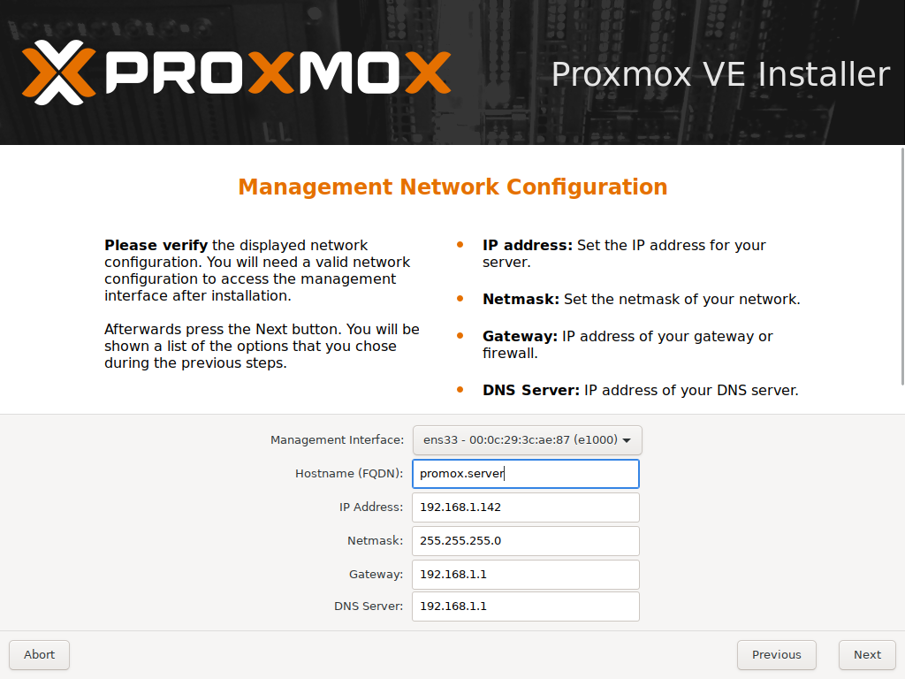
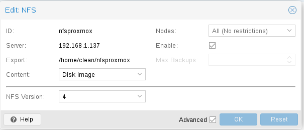
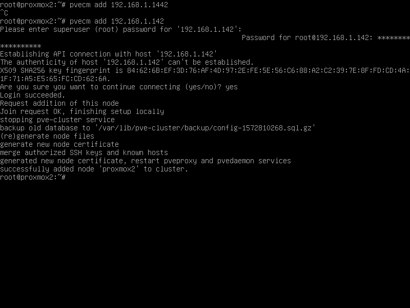

## Tabla de contenidos
0. [Introducción](#intro)

1. [Proxmox](#proxmox)
    + [Instalación](#install)

2. [NFS](#nfs)
3. [Cluster](#cluster)
4. [NAT](#nat)
5. [Containers](#container)
6. [Migración](#migracion)
7. [Conclusión](#conclusion)

8. [Fuentes](#fuentes)

<div id='intro'/>

## 0. Introducción 
Vamos a exponer la configuración junto a las definiciones vistas como pertinentes para comprender la practica correctamente.

Las imagenes del proceso de instalación se hayán en el directorio "Imagenes". Los logs se hayan en el directorio "Logs".

Despues de leer este documento podrás realizar los siguientes apartados:
+ Instalación de Proxmox
+ Configuración de Cluster
+ Añadir nodos
+ Configurar NFS como almacenamiento compartido en red
+ Configuración de NAT
+ Creación de contenderos
+ Migrar contenederos

Necesitaras:
+ Tantas maquinas virtuales como nodos haya en el cluster.
+ Una maquina central que contendrá nfs y nat.

<div id='proxmox'/>

## 1. Proxmox
Proxmox es una solución de codigo libre implementada para la implementacion de virtualización de servidores.
El primer paso para poder dar uso a proxmox es realizar la instalación, para ello debemos de disponer de la siguiente imagen que contienen el entorno de instalación:
+ https://www.proxmox.com/en/downloads/category/iso-images-pve

<div id='install'/>

### 1.1 Instalación de Proxmox
La unica "dificultad" que podría salirnos al instalar este tipo de sistemas operativos es especificar la siguiente informacion:



El nombre de dominio influira mucho, ya que si creamos un Cluster sin a ver cambiado el nombre del host no sucedera ningún tipo de error, pero de cambiarlo luego de crear el cluster, no se reconocera el host dentro del cluster.

El nombre de dns completo para el primer servidor proxmox debe ser el siguiente:
+ proxmox1.(nombre)

Proxmox para dar acceso internet a los equipos usa el modo puente entre los dispositivos por lo que de nodo a nodo contando que son servidores proxmox si habrá conexión pero no tendrán traducción nat los contenedor.

Necesitaremos dos servidores proxmox.

<div id='nfs'/>

## 2. NFS
NFS es un sistema de archivos en red, para su configuración en V4 bajo Debian (Maquina central) necesitaremos tener instalado los siguientes paquetes:

```
$ apt-get install nfs-kernel-server nfs-common
```
Primero necesitaremos un punto de montaje para nfs con los permisos conrrespondientes, en mi caso esta creado en el home de mi usuario

```
$ mkdir nfsproxmox
$ chmod 755 nfsproxmox
```
Una vez creado debemos de configurarlo dentro de "etc/exports" para poder exportarlo a la red.

```
$ /home/clean/nfsproxmox 192.168.1.160/24(rw,sync,fsid=0,no_root_squash,crossmnt,no_subtree_check,no_acl)
```
Una vez añadido lo exportaremos mediante el comando siguiente
```
exportfs -a
```
La opción "a" exporta todos los directorios hayados en "etc/exports".

Añadiremos NFS mediante el entorno web, para darle algún uso simplemente:



En el contenido debemos de especificar:
+ Template
+ Iso
+ Disk Image
+ Container

<div id='cluster'/>

## 3. Cluster
Un cluster en proxmox es un conjunto de servidores.

Para crear un cluster correctamente sin fallos debemos de contar con el hostname de los equipos correctamente situado. Una vez este editado correctamente podremos crearlo sin problemas.

Para crear un cluster con dos nodos usaremos el siguiente comando:

```
$ pvecm create marCluster
```
Para añadir un nodo a otro debemos de tener en cuenta el nombre completo DNS.
Debemos de tener claro que el cluster esta creado en "proxmox1" por lo que es local, para añadir el nodo debemos de acceder mediante ssh al proxmox2 desde proxmox1 y lanzar el siguiente comando:
```
$ pvecm add 192.168.1.142
```
Salida del comando:


Editaremos el fichero "etc/hosts" de la maquina central añadiendo el nombre y ip de los nodos, para asín tener DNS estático.

```
127.0.0.1         localhost
192.168.1.142     proxmox1.centos
192.168.1.145     proxmox2.centos
192.168.1.160     debian
192.168.1.147     proxmox1.100
192.168.1.146     proxmox2.101
```
<div id='nat'/>

## 4. Nat
Nat se encarga de realizar la traducción de dirección privada a publica. Por lo anteriormente explicado se sobre-entiende porque lo necesitamos.

Necesitamos modificar iptables para configurar dicha regla de NAT dentro de la maquina central (Debian).

Para ello dentro del fichero de configuración "/etc/network/interface" modificaremos la entrada y salida de nuestro ordenador central.

```
$ post-up   iptables -t nat -A POSTROUTING -s '192.168.1.0/24' -o ens33 -j MASQUERADE
$ post-down iptables -t nat -D POSTROUTING -s '192.168.1.0/24' -o ens33 -j MASQUERADE
```

Para hacerlo persistente la regla debemos de activar la traduccion del firewall en el fichero "/etc/sysctl.conf"

```
$ net.ipv4.ip_forward=1
```
Para guardar los cambios usaremos:

```
$ iptables-save
$ iptables-restore
```

Estado de la regla
```
Chain PREROUTING (policy ACCEPT)
target     prot opt source               destination         

Chain INPUT (policy ACCEPT)
target     prot opt source               destination         

Chain OUTPUT (policy ACCEPT)
target     prot opt source               destination         

Chain POSTROUTING (policy ACCEPT)
target     prot opt source               destination         
MASQUERADE  all  --  192.168.1.0/24       anywhere 
```

Para hacer que los containers salgan atraves de la maquina central, deberemos de hacer que su puerta de enlace sea la IP de la maquina central.

<div id='container'/>

## 5. Creación de los containers
Un container es una forma de virtualizar completamente un sistema operativo usando el OS del anfitrion haciendo uso del kernel.

Crearemos dos containers para poder realizar una migración, para ello usaremos uno de ejemplo:

Para crear un cointainer podemos hacerlo mediante interfaz web o comando (Usaremos esta).

Para crear un contenedor debemos de descargar la plantilla en:
+ http://download.proxmox.com/images/system/ 

Guardaremos la plantilla en el servidor NFS "/mnt/pve/nfsproxmox/template/cache/centos-7-default_20190926_amd64.tar.xz"

Crearemos el contenedor mediante la siguiente sintaxis:

```
$ pct create 100 nfsproxmox:2/debian-8.0-standard_8.0-1_amd64.tar.gz
```

Salida del comando:
```
Formatting '/mnt/pve/nfsproxmox/images/101/vm-101-disk-0.raw', fmt=raw size=2147483648
mke2fs 1.44.5 (15-Dec-2018)
Creating filesystem with 524288 4k blocks and 131072 inodes
Filesystem UUID: efa65580-285f-4c11-a358-48618457cfca
Superblock backups stored on blocks: 
	32768, 98304, 163840, 229376, 294912

Allocating group tables:  0/16     done                            
Writing inode tables:  0/16    done                            
Creating journal (16384 blocks): done
Multiple mount protection is enabled with update interval 5 seconds.
Writing superblocks and filesystem accounting information:  0/16     done

extracting archive '/mnt/pve/nfsproxmox/template/cache/centos-7-default_20190926_amd64.tar.xz'
Total bytes read: 422809600 (404MiB, 27MiB/s)
Detected container architecture: amd64
Creating SSH host key 'ssh_host_rsa_key' - this may take some time ...
done: SHA256:kRa2EvDfuCCr1sCvWiesCagyZavwXuUmDidElKIi478 root@localhost
Creating SSH host key 'ssh_host_dsa_key' - this may take some time ...
done: SHA256:ekVDa80Q+uxvEfMSXux0S46LesgDGTePoUgcS/3KuiQ root@localhost
Creating SSH host key 'ssh_host_ecdsa_key' - this may take some time ...
done: SHA256:mk7y2H/nKvhhWHYDP9cKwuricMMYisUz+d9LBlCD8Os root@localhost
Creating SSH host key 'ssh_host_ed25519_key' - this may take some time ...
done: SHA256:AjQAs5YD7uTWfzmQFt1o4SjfPfdfOuMAm7B30H8tdVg root@localhost
TASK OK
```

Configuraremos la red, contraseña, usuarios del containers 100, para ello usaremos los siguientes comandos dentro del servidor proxmox1(Contenedor apagado):
```
$ pct set 101 -net0 name=eth0,bridge=vmbr0,ip=192.168.1.147/24,gw=192.168.1.160
$ pct set 101 -nameserver 192.168.1.160
$ pct set 101 -cores 1
$ pct set 101 -swap 512
```
Para crear un usuario debemos de encender la maquina y acceder como root mediante
```
$ pct start 100
$ pct enter 100
```
Una vez dentro crearemos un usuario mediante:

```
$ adduser mar
$ passwdo mar
```
<div id='migracion'/>

## 6. Migración
La migración de un nodo en pocas palabras consiste en mover el disco duro de un contenedor a otro nodo.

Para realizar la migración los nodos o bien deben de estar apagados o bien hay que usar las siguientes opciones:
Se debe de contar con "lxc live migration" implementado
```
$ pct migrate <vmid> <target> --restart --timeout --online
```
Usaremos la migración offline para ello dentendremos la maquina mediante:
```
$ pct stop 100
```
Lo siguiente es mover el contenedor mediante la siguiente sintaxis:
```
pct migrate 100 proxmox2
```
Salida del comando:
```
2019-11-08 21:16:03 starting migration of CT 100 to node 'proxmox2' (192.168.1.145)
2019-11-08 21:16:03 volume 'nfsproxmox:100/vm-100-disk-0.raw' is on shared storage 'nfsproxmox'
2019-11-08 21:16:03 start final cleanup
2019-11-08 21:16:05 migration finished successfully (duration 00:00:04)
```
Y si accedemos a proxmox2 podremos comprobar la existencia del container de proxmox1
```
root@proxmox2:~# pct list
VMID       Status     Lock         Name                
101        stopped                 CT101               
root@proxmox2:~# pct list
VMID       Status     Lock         Name                
100        stopped                 CT100               
101        stopped                 CT101  

```
<div id='conclusion'/>

## 7. Conclusión
Proxmox es una potente herramienta de codigo abierto que ofrece infinidad de posibilidad de trabajar con ella de forma practica y didactica, mas adelante le daremos otros uso. Pero el visto hasta ahora es suficiente para entender su potencial.

<div id='fuentes'/>

## 8. Fuentes 
+ https://pve.proxmox.com/wiki/Linux_Container
+ https://pve.proxmox.com/wiki/Network_Configuration

>Marouane Boukhriss


