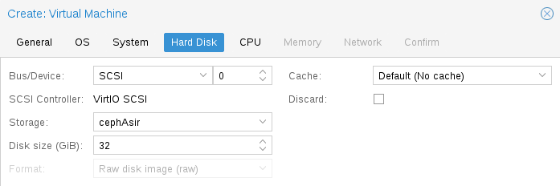
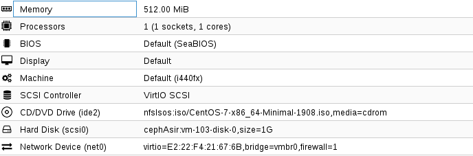

## Tabla de contenidos
0. [Introducción](#intro)

1. [Ceph](#proxmox)
    + [Instalación](#install)
2. [NTP](#ntp)
    + [Servidor](#ntps)
    + [Cliente](#ntpc)
3. [HDD](#hdd)
4. [Cluster](#cluster)
5. [Configuración Ceph](#cephc)
6. [Migración](#migracion)
7. [Conclusión](#conclusion)
8. [Fuentes](#fuentes)

<div id='intro'/>

## 0. Introducción 
Veremos la configuración de un datacenter junto a ceph
Las imagenes del proceso de instalación se hayán en el directorio "Imagenes". Los logs se hayan en el directorio "Logs".
Despues de cada configuración reiniciarmos el servicio mediante "systemctl restart ntp"

Despues de leer este documento podrás realizar los siguientes apartados:
+ Configuración de Cluster
+ Añadir nodos
+ Configuración NTP para sincronizar la hora.
+ Gestionar discos duros
+ Instalación de ceph
+ Configuración de Ceph
+ Creación de maquinas virtuales

Necesitaras:
+ 3 maquinas como nodos en el cluster.

<div id='ceph'/>

## 1. Ceph
Ceph File System es un sistema de archivos de codigo libre, está diseñado para el uso con gran cantidad de datos, enfocado para el uso con Big Data
Ceph para su funcionamiento requiere de 

+ Ceph Monitor (ceph-mon)
    + Realizan una copia master del mapa del cluster.
+ Ceph Manager (ceph-mgr)
    + Crean las interfaces para el cluster.
+ Ceph OSD (ceph-osd)
    + Son los discos duros que usaremos para cada nodo.

<div id='install'/>

### 1.1 Instalación de Ceph
Para la instalación de ceph usaremos un comando que viene implementado con proxmox. Por defecto instala la versión nautilus, esta versión es la que usaremos

```
$ pveceph install
```
Se repite el mismo proceso en los 3 nodos,más adelante veremos la configuración.
<div id='ntp'/>

## 2. NTP
NTP es un sistema para sincronizar la hora de los nodos en red o localmente. Para la configuración en la vista del servidor no necesitamos nada ya que mediante la propia instalación de ceph se instala el servicio ntp.
Esta parte es esencial para la configuración de ceph, por ende es lo primero que haremos junto a gestionar los discos antes de configurar ceph
Para la vista del cliente necesitamos un paquete que no viene instalado por defecto, este paquete(ntpdate) lo que hará es sincronizar su hora con la de servidor localmente.
Para instalar ntpdate usaremos el siguiente comando:

```
$ apt-get install ntpdate
```

<div id='ntps'/>

#### 2.1 NTP Server 
El fichero de configuración original tiene el siguiente aspecto (/etc/ntp.conf)

```
# Se establece la política predeterminada para cualquier
# servidor de tiempo utilizado: se permite la sincronización
# de tiempo con las fuentes, pero sin permitir a la fuente 
# consultar (noquery), ni modificar el servicio en el 
# sistema (nomodify) y declinando proveer mensajes de 
# registro (notrap).
restrict default nomodify notrap noquery
restrict -6 default nomodify notrap noquery

# Permitir todo el acceso a la interfaz de retorno del
# sistema.
restrict 127.0.0.1
restrict -6 ::1

# Se le permite a las redes local sincronizar con el servidor
# pero sin permitirles modificar la configuración del
# sistema y sin usar a éstos como iguales para sincronizar.
# Cambiar por las que correspondan a sus propias redes locales.
#restrict x.x.x.x.x mask 255.255.255.0 nomodify notrap

# Reloj local indisciplinado.
# Este es un controlador emulado que se utiliza sólo como
# respaldo cuando ninguna de las fuentes reales están
# disponibles.
fudge   127.127.1.0 stratum 10
server  127.127.1.0

# Archivo de variaciones.
driftfile /var/lib/ntp/drift
broadcastdelay  0.008

# Archivo de claves si acaso fuesen necesarias para realizar
# consultas
keys            /etc/ntp/keys

# Lista de servidores de tiempo de estrato 1 o 2.
# Se recomienda tener al menos 3 servidores listados.
server 0.pool.ntp.org iburst
server 1.pool.ntp.org iburst
server 2.pool.ntp.org iburst
server 3.pool.ntp.org iburst

# Se activa la difusión hacia los clientes
broadcastclient
```

La unica modificación que haremos es descomentar una linea y modificarla para darle el siguiente aspecto

```
restrict 10.10.2.0 mask 255.255.255.0 nomodify notrap
```
<div id='ntpc'/>

#### 2.2 NTP Client 
En la parte del cliente lo que haremos será especificar el servidor añadiendo la siguiente linea en "/etc/ntp.conf" 

```
server 10.10.2.5 iburst prefer
```
El ultimo paso es sincronizar la hora con el servidor mediante su ip con ayuda del siguiente comando:

```
$ ntpdate -u 10.10.2.5

server 10.10.2.5, stratum 2, offset −0.127936, delay 0.02600
22 nov 18:30:23 ntpdate[7716]: adjust time server 10.10.2.5 offset −0.127936 sec
```
Para observar la lista de servidores que estan sincronizados actualmente lanzaremos el siguiente comando:

```
$ ntpq -p
remote           refid   	st t when poll reach    delay  offset  jitter
==============================================================================
*LOCAL      10.10.2.5    2 u  207  256   37   10.985  -215.79 256.992
+0.pool.ntp.org     89.175.22.41     2 u  193  256   37   32.623  -207.70 259.121
+1.pool.ntp.org   89.175.22.41     2 u  198  256   37    0.621  -216.90 257.037
+2.pool.ntp.org      193.11.166.20    2 u  193  256   37   32.028  -207.41 259.863
+3.pool.ntp.org     193.79.237.14    2 u  192  256   37   50.573  -206.62 259.542
```
<div id='hdd'/>

## 3.Discos duros
Antes de configurar ceph necesitaremos tener los discos duros correctamente configurados, para poder añadirlos al pool de ceph. Este termino se le conoce como osd.
Debido a que son 1 disco duro por maquina y disponemos de 3 maquinas, realizaremos el mismo proceso en los 3 equipos.
Para conocer los discos duros que disponemos en nuestro equipo usaremos el comando:

```
$ lsblk
sda 8:0 0 465,8G 0 disk
├─sda2 8:2 0 1K 0 part
├─sda5 8:5 0 2G 0 part [SWAP]
├─sda6 8:6 0 20G 0 part /
└─sda7 8:7 0 443,3G 0 part /home
sdb 8:16 1 15,1G 0 disk
└─sdb1 8:17 1 15,1G 0 part
```
En nuestro caso el disco duro usado es sdb, vamos a dejarlo sin gestionar lo que quiere decir que no tendrá particiones.
Para ello usaremos el siguiente comando
```
$ fdisk /dev/sdb
#Borramos la particion
Command (m for help): d
Partition number (1): 1
#Guardaremos los cambios
Command (m for help): w
```

<div id='cluster'/>

## 4. Cluster

Debido a que hemos explicado en la anterior practica el proceso omitiremos algunas partes y solo usaremos los comandos necesarios.

```
$ pvecm create cephCluster
```
Para añadir un nodo al cluster debemos de tener la dirección ip del master cluster.
```
$ pvecm add 10.10.2.5
# Mismo proceso en el 3 equipo restante
```
<div id='cephc'/>

## 5. Configuración de ceph
En la configuración de ceph procederemos a inicializar los 3 nodos mediante el siguiente comando:

```
$ pveceph init -network 10.10.3.0/24
# Vlan de ceph
```
Una vez iniciada la configuración procederemos a crear manager en los 3 nodos para que dispongamos de interfaces.

```
pveceph createmgr
```
Se puede disponer de un solo monitor pero crearemos tres monitores para disponer de copias extras del mapa por temas de disponibilidad.
```
pveceph createmon
```
Una vez creados los 3 monitores procederemos a darle uso a los tres discos duros para cada uno de los nodos de ceph.
```
pveceph createosd /dev/sdb
```
Aquí una demostración con los 3 osd creados
```
$ root@proxmox1:~# ceph osd tree
ID CLASS WEIGHT  TYPE NAME         STATUS REWEIGHT PRI-AFF 
-1       0.02637 root default                              
-3       0.00879     host proxmox1                         
 0   hdd 0.00879         osd.0         up  1.00000 1.00000 
-5       0.00879     host proxmox2                         
 1   hdd 0.00879         osd.1       down        0 1.00000 
-7       0.00879     host proxmox3                         
 2   hdd 0.00879         osd.2         up  1.00000 1.00000 

```
Y finalmente lo que haremos será especificar el pool de discos duros que se usaran.
```
pveceph createpool cephPool --pg_num 100
#100 es debido a que son 3 discos duros. Se usa la siguiente formula

             (OSDs * 100)
Total PGs =  ------------
              pool size

En nuestro caso:
(3 * 100)
----------- = 100
     3
```
El siguiente paso será crear las maquinas virtuales para que usen el almacenamiento de ceph y así podriamos ver finalmente la migración.
El proceso de instalación lo unico interesante es especificar el almacenamiento de ceph para la maquina virtual



A continuación una muestra de una maquina virtual creada finalmente.



Verificación final del estado de ceph
```
$ root@proxmox1:~# ceph health
HEALTH_OK
```
<div id='conclusion'/>

## 7. Conclusión
Ceph esta pensado para BIG DATA , aunque ofrece flexibilidad como hemos visto. Junto a proxmox es bastante sencilla su configuración y muy util para entornos de virtualizacion bastante grandes.
<div id='fuentes'/>

## 8. Fuentes 
+ https://pve.proxmox.com/wiki/Qemu/KVM_Virtual_Machines#qm_migration
+ https://pve.proxmox.com/wiki/Network_Configuration

>Marouane Boukhriss


